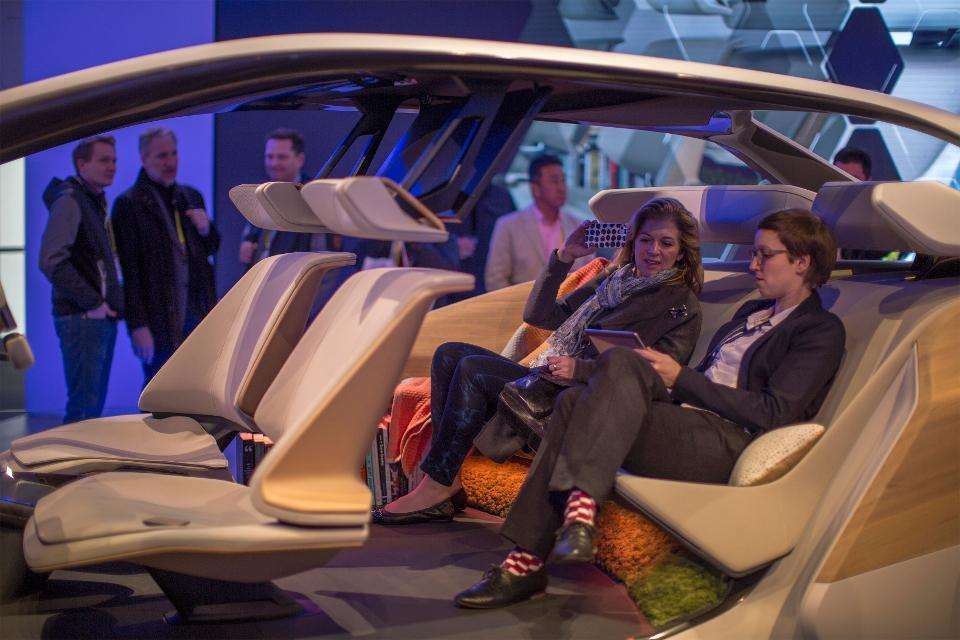

# CES 2018 Means Scrabble Playing Robots, Connected Microscopes, Sensors And Smart Fabric

> 
>
> © Provided by Forbes Media LLC
> 
> People sit in the Inside Future concept sculpture of an interior for BMW during CES in Las Vegas, Nevada, January 7, 2017. Photo credit DAVID MCNEW/AFP/Getty Images.

The US consumer electronics industry is predicted to reach 228 billion dollars by the close of 2017.

The 51st annual Consumer Electronics Show (CES) kicks off on January 9, 2018, in Las Vegas and there will be plenty of new gadgets, smart home devices, self-driving cars and wearables in the spotlight. Tech brands like LG have already announced their ThinQ speaker ahead of CES, while Samsung stays quiet on the possibility of the debut their foldable phone, the Galaxy X. 

But this year, there will be some new technology and gadgets that might not make the headlines. Here’s a look at a few exciting applications and technology we’ll see at CES 2018.

## Scrabble-playing robot

The Industrial Technology Research Institute (ITRI) is a Taiwan-based high-tech applied research organization that will let visitors play Scrabble with a robot. The robot, running on ITRI’s [Intelligent Vision System](https://www.youtube.com/watch?v=vMWj8q8r2TY&feature=youtu.be), will also pour coffee for its human opponent. 

The vision system inside the Scrabble-playing robot is designed to let robots and other machines interpret the visual world around it, act on that visual information and then learn from that same experience. In ITRI’s demonstration at CES 2018, the robot will be able to distinguish between a variety of Scrabble tiles, words and locations and between some different coffee cups and how full or empty they are. The robot can also grip and interact with the Scrabble tiles and coffee cups while avoiding crashing into other objects or spilling the coffee.

If that’s not enough, the robot can also evaluate its human opponent’s Scrabble moves, verify spelling visually and with the help of a dictionary in its game engine. It will also be able to determine which words to spell for the highest possible score.

## Connected Telescope

A French startup, [Unistellar](http://unistellaroptics.com/product/), will show its Enhanced Vision telescope (eVscope) at CES 2018. The product debuted at CES 2017 but has spent the past year fundraising and developing the light amplification technology including an internal map of millions of stars. The consumer telescope uses a low-light sensor to accumulate light through a series of short exposures. The company says this allows the user to see nebulae, faraway planets, and objects too faint to be seen clearly through conventional telescopes, even in urban environments. The company will receive a 2018 Innovation Award at CES and raised [$2.2 Million on Kickstarter](https://unistellaroptics.us16.list-manage.com/track/click?u=dcb92f916c77d982ab4f0dc26&id=f1fe3f4c93&e=b5b6137c0b) in November 2017. 

Unisteller also announced a partnership with the [SETI Institute](https://www.seti.org/seti-institute/press-release/seti-institute-unistellar-partnership-promises-revolutionize-amateur) in Silicon Valley in July 2017 that will develop a Campaign Mode for the telescope which allows users around the world to collect data on objects that are of scientific interest to researchers. In Campaign Mode, image data captured by participants are automatically sent to a data repository at the SETI Institute’s headquarters in Silicon Valley. This will give the scientific community access to image data for specific objects from thousands of telescopes around the world which could enable new discoveries of the world around us.

## Motion sensors 

Finland’s [Suunto](http://www.suunto.com/en-US/) will showcase two Finnish fitness and health tech companies using their [Movesense](http://www.movesense.com/) motion-sensing technology in their fitness and tech products at CES 2018. The Movesense sensor measures 1.44 inches in diameter and 0.35 ounces and combines an accelerometer, gyroscope, magnetometer, temperature sensor, heart rate, and ECG sensor into a pre-built package that can be integrated into a device or clothing. The sensor allows fitness and wearable devices to generate data that can improve athletic performance, see equipment failures and aid rehabilitation programs.

[Ain1](http://ain1.ai/) is developing a mobile platform with the Movesense sensor for coaching, rehabilitation and measuring human performance. After a patient or athlete finishes a set of movements or exercises, the device captures the precise measurements from those actions so they can be monitored and evaluated for risk or improvement.

[Runteq](http://www.runteq.com/) is introducing its Movesense-based wearable product and cloud-based coaching app. Runteq programmed its proprietary running biomechanics algorithms into the Movesense sensors which will power their AI and machine learning-driven coaching experience for users.

## Smart Fabric

[SUPA](https://www.supa.ai/), NY-based technology fashion company, which turns apparel into a data platform is one of the companies that’s also using the Movesense platform.

From embroidering circuits into fabric or printing transparent sensor material onto textiles, the potential of smart fabrics is growing. Research from [*New Electronics*](http://www.newelectronics.co.uk/electronics-technology/while-smart-textiles-for-wearables-remains-in-its-infancy-its-potential-is-huge/119045/)predicts that the market for smart fabrics or smart textiles with a digital component is expected to be worth more than $1.8 Billion by 2021.

Founded by Sabine Seymour, SUPA is building biometric data kits comprised of fabric with sensors and data. Each different fabric functions differently for each use — snowboarding, surfing, chronic condition, etc. It’s a modular distributed, and secure biometric data platform for using sensors. The company uses AI to contextualizes the biometric data to provide highly personalized insights for individuals as well as data analytics with the goal to build a secure vault of biometric data and democratize healthcare. 

## Augmented Reality

And in the world of Augmented Reality (AR) meets messaging, stealth startup AiFi (founded by developer [Abhishek Singh](http://shek.it/) who created a life-size Super Mario Bros. level and played it New York’s Central Park wearing HoloLens) is showing its new AR app, Holo Messenger made the internet rounds in [September 2017](https://uploadvr.com/become-star-wars-hologram-help-r2-d2-arkit/).  Holo Messenger is built with Apple’s ARKit and lets users turn themselves into a hologram to deliver an AR message, think R2-D2 when he projected Princess Leia’s plea for help in *Star Wars.*