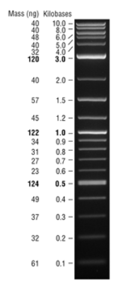
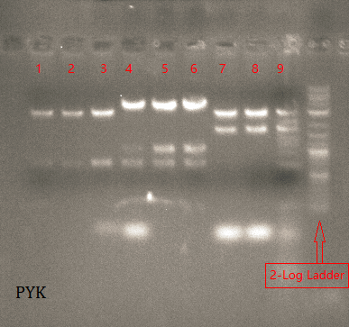

# 20180208
---

## 1) 小提质粒
| Label | Concentration |
|--------|-------------------|
|           |                          |
|           |                          |

## 2) 酶切
| Label | Enzyme | length(bp) |
|----|---|----|
| pYK018-31/32/33 | EcoRI & BamHI | 3000 |
| pYK019-31/32/33 |     AgeI & BamHI     |        3900     |
| pYK020-31/32/33 |     EcoRI & BamHI     |    3000  |

> **2-Log DNA Ladder(0.1-10.0 kb)**    
>  
>
>  **Samples**
>  
> -  1~3: pYK018-31/32/33  
> - 4~5: pYK019-31/32/33 
> - 6~9 : pYK020-31/32/33 

## 3) Sequence
| Samples | Type | Primer |
|--------------|---------|-----------|
| pSG017-32/33 | plasmid | pEGFP-N-3' |
| pSG018-31/32 | plasmid | pEGFP-N-3' |
| pSG021-31 | plasmid | pEGFP-N-3' |
| pYK018-32/33 | plasmid | plag-CMV-F(合成) |
| pYK019-32/33 | plasmid | plag-CMV-F(合成) & qE1forward |
| pYK020-32/33 | plasmid | plag-CMV-F(合成) & qE1forward |

## END

