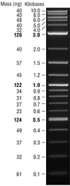
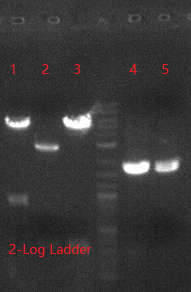

**20180209**

>     |  
>
>    
>
>    -   1: 094-Frag-2, 4393 bp
>    -   2: 095-Frag-1, 2700 bp
>    -   3: 095-Frag-2, 324 bp
>    -   4~5: 095-Frag-3, 1600 bp

**1 构建 pXY094**

1.1 获取片段

-   094-Frag-2：digest PYB006 with NcoI & SpeI, 4393 bp, 37°C 1.5 hours,然后切胶回收
-   094-Frag-1: annealing XY01180201 & XY01180202, then 磷酸化得到094-Frag-1k
    - **annealing 10uL 体系**
        - 100μM primerF	1 μL
        	 100μM primerR	1 μL
			 PNK buffer	1 μL
        	 ddH2O	7μL

1.2 开始构建：ligation

-   预处理094-Frag-1k：将 1uL的磷酸化产物溶解到 100uL 的ddH2O中

>   **ligation 10uL 体系**
>
>   -   094-Frag-1k(1/100uL H2O)		1uL
>   	   094-Frag-2(66ng/uL)			1.5uL
>   	   T4 DNA ligase(Thermo)		0.2uL
>   	   T4 ligase buf.     				1uL
>   	   ddH2O                     			6.3uL
>
>   *反应条件：16°C 1.5hours, then 转化（Kana）*

​    

**2 构建 pXY095**

2.1 获取片段

-   095-Frag-1：digest pZ251 with xhoI & BamHI, 2700 bp, 37°C 1.5 hours,然后切胶回收
-   095-Frag-2：digest 6N-Il2 with xhoI & NheI, 324 bp, 37°C 1.5 hours,然后切胶回收
-   095-Frag-3: KOD PCR Luc from pH446 with XY01180203 & XY01180204, 1600 bp,然后切胶回收

2.2 开始method 1(BsaI GoldenGate)构建：

>   **BsaI GoldenGate 10uL 体系** 得到 **pXY095-m1** 
>
>   -   095-Frag-1(21ng/uL)		2.5uL
>   	   095-Frag-2(6ng/uL)		5uL
>   	   095-Frag-3(50ng/uL)		1uL
>   	   T4 ligase buffer(Thermo)	1uL
>   	   BsaI(NEB)				0.5uL
>   	   T4 ligase(Thermo)		0.3uL
>   	   ddH2O					0
>
>   
>
>   **反应条件**
>
>   -   37°C/5m
>   -   (37°C/5m + 25°C/5m) x 8
>   -   25°C/15m
>   -   16°C/keep
>
>   then, 转化(kana)

2.3 开始method 2(ligation)构建：

-   digest 095-Frag-3 with BasI 得到 095-Frag-3d, then 切胶回收

> **ligation 10uL 得到 pXY095-m1*2
>
> -   095-Frag-3d
> -   095-Frag-1(21ng/uL)		2.5uL
> -   095-Frag-2(6ng/uL)		5uL
> -     T4 DNA ligase(Thermo)		0.2uL
>        T4 ligase buf.     				1uL
>        ddH2O                     			6.3uL
> -   ddH2O					0